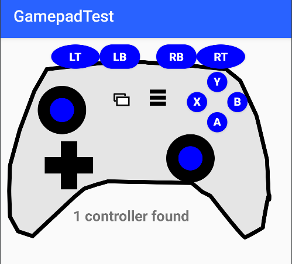

# GamepadTest

Currently updating to this Android Studio version.  Some clean up still needed.

<b> Android Studio Narwhal 4 Feature Drop | 2025.1.4</b>

Repository link on Github:  https://github.com/bammellab/GamepadTest

Screenshot of application:

This Android App listens for connected GameControllers and displays the joysticks,
buttons, and Dpad visually.

The app was developed and tested so far with the TRUST GXT 590 Gamepad:

https://www.trust.com/en/product/22258-gxt-590-bosi-bluetooth-wireless-gamepad

## Issues

### Connection as "Input Device" is flakey

What I have found from casual experimentation is that the TRUST GXT 590 toggles between
connecting via BlueTooth to my Xperia phone as a regular device and as an "Input Device".
It MUST be in the "Input Device" mode to work as a GamePad.  So I toggle it by reconnecting.
Sometimes I have to make the Bluetooth system forget the device and do another Pair operation
before things get back to "toggle" mode.   Basically pretty bad for reliability.

### Other notes

The BuildConfig structure is required and is turned on in the build.gradle.kts gradle file, as follows

    android {
    // ...
    
        buildFeatures {
            buildConfig = true
        }
    }

A nice thank you to this SO author: https://stackoverflow.com/a/79801435/3853712

### Compatibility

This compatibility matrix writeup is the first sign that I have seen
that Google is paying attention to gamepad issues.

That is a good sign.  Unfortunately for Android - looks like it is in Android 10
that things have changed.  And I have Android 9 on my Sony Xperia phone, LOL.   I will
update after I get my hands on an Android 10 based phone.

https://support.google.com/stadia/answer/9578631?hl=en

### Android IssueTracker (no vibration control!!)

One big feature that is missing is any control over vibration on the gamepads.
They are only a source of input events.  No control over a gamepad is evident.

[Feature Request] Support for rumble on controllers
https://issuetracker.google.com/issues/161057609

37115804 Add support for Xbox One S controller over Bluetooth
https://issuetracker.google.com/issues/37115804

[Android 11 DP/Beta] Bluetooth Gamepads Aren't Reported as Source of Input Events
https://issuetracker.google.com/issues/163120692

[Android 11 Beta] XBox Controller (FLAGGED as WONT FIX)
https://issuetracker.google.com/issues/158758782

### Keymapping issues

I notice that the Xbox Gamepad changed from KEYCODE_BACK to KEYCODE_SELECT on the
left button at the middle of the unit (with the two squares).

On hacking the keymap to workaround the default button mapping:

https://www.reddit.com/r/GeForceNOW/comments/fkw2il/guide_fix_for_the_incorrect_xbox_controller/

### Related apps

#### Unity Android Controller Logger

Evangelos Oganesov

https://play.google.com/store/apps/details?id=com.Evag.UACL

### Gamepad tester

elron

https://play.google.com/store/apps/details?id=ru.elron.gamepadtester&hl=en_US

### See also

https://forum.unity.com/threads/heres-all-the-buttons-for-a-gamepad-for-android.732698/
